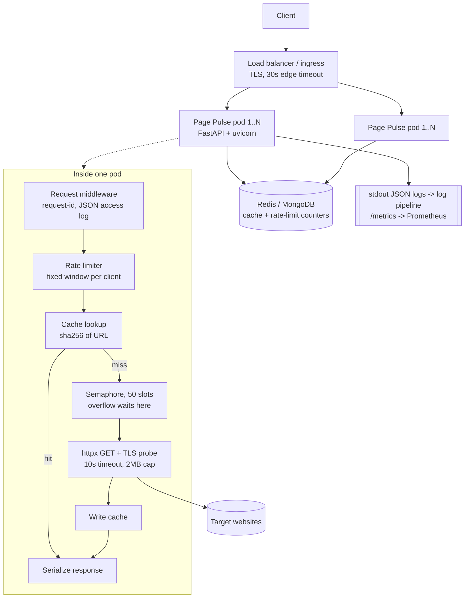

# Task B — Designing Page Pulse for scale

**Target:** 10,000 audits/day, bursts of 500 concurrent requests, a customer-facing
response-time SLA.

**SLA I am designing to:** 99% of `POST /api/audit` calls answered in **< 3 s**, and
99.9% of calls answered *at all* (a structured error inside 3 s counts as answered;
a hung socket does not). This distinction drives most of the decisions below.

---

## 1. The load, in plain numbers

| Quantity | Value | Note |
|---|---|---|
| Daily audits | 10,000 | ~0.12 req/s averaged |
| Realistic daily peak | ~1.5 req/s | assuming 80% of traffic in 8 business hours |
| Burst | 500 concurrent | the actual design constraint |
| Work per audit | 1 outbound HTTP GET + 1 TLS probe | 50–3000 ms, dominated by the *target's* speed |

The service is almost entirely **I/O-bound waiting on third-party servers**. CPU
cost per audit is a few milliseconds of HTML parsing. So the design problem is not
throughput — it is *what happens to the 500th caller while 499 sockets are open*.

A single async worker holding 500 open sockets is memory-cheap but latency-hostile:
one slow target starves everyone. So concurrency is deliberately **bounded** and the
overflow is **queued with a deadline**, not dropped and not unbounded.

---

## 2. Components and data flow

Request path, step by step:

1. **Ingress** terminates TLS and applies a 30 s hard timeout — strictly longer than
   any internal deadline so the edge never kills a request we would have answered.
2. **Middleware** assigns an `X-Request-ID` (or honours the caller's), binds it to a
   `contextvar` so every log line in that request carries it, and emits one
   structured access record on the way out.
3. **Rate limiter** checks the caller's window *before* any expensive work. A batch of
   N URLs costs N units, so batching cannot be used to bypass the limit.
4. **Cache** is keyed on `sha256(url)`. A hit returns in single-digit milliseconds and
   never touches the network.
5. **Semaphore (50 slots per pod)** bounds outbound concurrency. Callers beyond 50 wait
   in the event loop rather than opening a 51st socket.
6. **Fetch** runs on one shared `httpx.AsyncClient` (connection pooling; a client per
   request is the classic socket-exhaustion bug here) with a 10 s timeout, 5-redirect
   cap and 2 MB body cap.
7. **Cache write** happens only for successful fetches. Failures are never cached —
   otherwise a transient blip is served to every caller for the next 5 minutes.

### Where state lives

| State | Location | Lifetime | Why there |
|---|---|---|---|
| Audit results | Shared store (Redis in prod, Mongo acceptable) | 5 min TTL | Must be shared, or each pod re-fetches the same URL |
| Rate-limit counters | Same shared store, atomic `INCR` | 1 h window | Per-pod counters would let N pods grant N× the limit |
| Semaphore / queue | In-process | request | Concurrency is a property of *this* pod's sockets |
| Connection pool | In-process | pod lifetime | Sockets are not shareable |
| Logs & metrics | stdout → collector | 30 days | Pods are cattle |

Application pods hold **no durable state**, so they scale and restart freely.

### Sizing for the burst

50 concurrent × N pods ≥ 500 → **N = 10 pods** absorbs the full burst with zero
queueing. In practice 4 pods (200 concurrent) is the steady-state footprint, with the
HPA scaling on queue depth to 10 during bursts; the remaining 300 callers wait a few
hundred milliseconds rather than being rejected. Requests that would wait longer than
the remaining SLA budget should be shed with `503` + `Retry-After` — better a fast
honest failure than a timeout at the edge.

---

## 3. Queueing strategy

Three layers, each with an explicit bound:

| Layer | Bound | Behaviour when full |
|---|---|---|
| Ingress connections | ~1000/pod | kernel accept queue, then connection refused |
| In-pod semaphore | 50 | callers await a slot (this is the real queue) |
| httpx connection pool | 100 | reuses keep-alive connections |

The queue is intentionally **implicit and short-lived** (an asyncio wait), not a
broker. A message broker (SQS/Celery) would make `POST /api/audit` asynchronous —
the caller would receive a job id and poll. That is the right design for *scheduled*
or *bulk* audits, and the wrong one for a synchronous customer-facing SLA, because it
adds a round trip and a polling loop to a workload that finishes in under a second.

**When I would add a broker:** the moment audits become scheduled/recurring, or a
single audit exceeds ~5 s of work (e.g. adding Lighthouse runs). The API surface is
already shaped for it — `request_id` is issued up front, so a `202 Accepted` +
`GET /api/audit/{request_id}` variant is an additive change, not a rewrite.

**Fairness:** the semaphore is FIFO, so one client submitting 200 URLs cannot starve
others *beyond* the rate limiter's ceiling, which is the real fairness control.

---

## 4. Technology decision record

Each decision names what I picked, why, and what I rejected.

### 4.1 FastAPI + uvicorn — **rejected: Flask, Django REST**

Chosen because the workload is I/O-bound: one event loop holds 50 in-flight external
requests on a single core, and Pydantic gives me request validation and the OpenAPI
contract from the same type definitions.

*Flask* is synchronous by default; 50 concurrent audits means 50 worker threads and a
much larger memory/context-switch footprint for identical work. *Django REST Framework*
brings an ORM, migrations and an admin I would never use — weight without benefit for
a stateless service with no relational model. The trade-off I accept: async code makes
one blocking call (the TLS probe) dangerous, which is why it runs in an executor.

### 4.2 Redis for cache + counters — **rejected: MongoDB, in-process only**

Chosen because both workloads are ephemeral key/value with TTLs, and rate limiting
needs an **atomic increment** — `INCR` + `EXPIRE` is exactly the primitive required,
sub-millisecond, with native key expiry.

*MongoDB* works (and the code ships with a Mongo backend, since that is what the
existing platform provides) but it is a document database doing a key/value job:
TTL reclamation is a background sweep on a 60 s cycle, and every counter update is a
disk-backed write. *In-process only* is what the repo defaults to for dev/CI — it is
correct for a single instance and silently wrong across replicas, because each pod
would keep its own counters and its own cache. Storage is therefore an interface with
two implementations (`app/storage.py`), selected by `MONGO_URL`; adding Redis is a
third class, not a refactor.

### 4.3 httpx (async) — **rejected: requests, aiohttp**

Chosen for first-class async, per-request timeout granularity (connect/read/write/pool),
explicit redirect caps, and `MockTransport`, which lets the entire test suite run
without network access.

*requests* is synchronous — it would block the event loop. *aiohttp* is a fine async
client, but httpx's API is closer to `requests` (lower onboarding cost for the next
engineer) and its test transport is better. Trade-off: httpx is somewhat slower than
aiohttp under extreme load; irrelevant when the target server dominates latency.

### 4.4 selectolax for HTML parsing — **rejected: BeautifulSoup + lxml, regex**

Chosen because parsing is the only CPU work in the request path and it runs on the
event loop. selectolax (Modest/lexbor) parses a typical page in ~1 ms versus ~20–50 ms
for BeautifulSoup — a 20× reduction in event-loop blocking per audit.

*BeautifulSoup* is more ergonomic and I would use it in a script; here it is the single
biggest source of loop stalls under burst. *Regex* over HTML is not on the table.

### 4.5 Fixed-window rate limiting — **rejected: sliding-window log, token bucket**

Chosen for cost: one counter and one timestamp per client, one atomic op per request.
At a 100/hour limit, the worst case is a client sending 200 requests across a window
boundary — acceptable, because the limit exists to prevent abuse, not to meter billing.

*Sliding-window log* is precise but stores every timestamp — O(requests) memory per
client. *Token bucket* handles bursts more gracefully and is the natural upgrade if
limits ever become a paid product feature; it needs Lua/atomic-script support to stay
race-free, which is complexity I do not need at this limit.

### 4.6 Synchronous API — **rejected: job queue + polling, webhooks**

Covered in §3: a customer-facing latency SLA implies a synchronous answer. Webhooks
would be added alongside, not instead.

---

## 5. The three failure modes I actually expect

### Failure 1 — One slow target consumes the concurrency budget

*Mechanism.* A customer audits a URL that accepts the TCP connection and then sends
bytes at a trickle. With a naive implementation the socket stays open for minutes.
Fifty such requests occupy every slot on a pod; healthy requests queue behind them and
the edge times out. This is the single most likely outage, because it needs no traffic
spike — one pathological target is enough.

*Mitigations, in order of importance:*
1. **A 10 s total timeout on every outbound request**, not just connect. Already
   enforced via `httpx.Timeout`. This alone caps the blast radius.
2. **A 2 MB body cap** so a multi-gigabyte response cannot exhaust memory.
3. **A 5-redirect cap** so redirect loops terminate.
4. **Per-host circuit breaker** (next iteration): after 3 consecutive timeouts on a
   host, fail fast for 60 s. This turns 50 slow slots into 50 instant errors.
5. **Alert** on `p95 upstream latency` and `upstream_timeout` rate, split by host, so
   the offending target is identifiable in one dashboard click.

### Failure 2 — Cache stampede on a popular URL

*Mechanism.* A dashboard polls the same URL from many clients. The entry expires at
T+300 s; every in-flight request misses simultaneously and each one launches its own
fetch. One cached URL becomes 200 outbound requests in the same second — we DDoS the
target, they rate-limit or ban us, and our own latency spikes.

*Mitigations:*
1. **Single-flight coalescing**: keep an in-pod map of in-progress URLs; concurrent
   callers await the same future instead of issuing duplicate fetches. Cuts N
   simultaneous fetches to N/pods.
2. **Jittered TTL** (`300 s ± 10%`) so entries created together do not expire together.
3. **Serve-stale-while-revalidating**: return the expired entry immediately, refresh in
   the background. Turns a latency cliff into a slightly stale answer — the right
   trade for an audit result.
4. **Alert** when cache hit rate drops more than 20 points below its 7-day baseline.

### Failure 3 — Shared state becomes unavailable or slow

*Mechanism.* Redis/Mongo fails over, or its connection pool saturates during the burst
(500 concurrent × 2 ops). Every request path touches the store twice, so a store that
answers in 2 s turns a 200 ms service into a 4 s service — and if the client is
configured to retry forever, into a hung one.

*Mitigations:*
1. **Fail open on the rate limiter, fail closed on nothing.** If the counter store is
   unreachable, allow the request and emit a `ratelimit.degraded` metric. Availability
   of the core product beats perfect enforcement of a soft quota.
2. **Treat a cache error as a miss.** The audit still works; it is just slower.
3. **Short, explicit store timeouts** (250 ms) with a bounded pool (200 connections),
   so a slow store degrades latency by 0.5 s, not by 10 s.
4. **Circuit-break the store** after sustained errors and run pure in-memory for the
   duration — correctness degrades gracefully (per-pod counters, per-pod cache) instead
   of the service going down.
5. **Alert** on store error rate > 1% and pool utilisation > 80%.

Common thread: every dependency has a timeout, a bound, and a defined behaviour when
it is unavailable.

---

## 6. Operations

Monitoring, alert thresholds, deployment and rollback are specified in
[observability.md](observability.md).

---

## 7. Assumptions

- Targets are public internet URLs; auditing private/internal addresses is refused by
  default (SSRF guard), overridable by config for on-prem use.
- Audit results are not customer-confidential, so a shared cache keyed only by URL is
  acceptable. If per-tenant results ever diverge, the cache key gains a tenant prefix.
- 10k/day is today's number; the design's hard limit is ~10 audits/s sustained per pod,
  roughly 8.6 M/day at 10 pods — three orders of magnitude of headroom.
- Clients are identified by an `X-Client-ID` header (or IP as a fallback). Real API-key
  authentication is the obvious next step and would replace the header.
